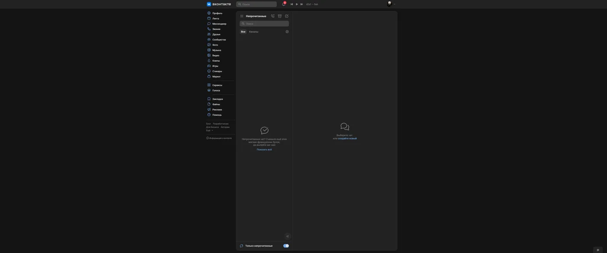
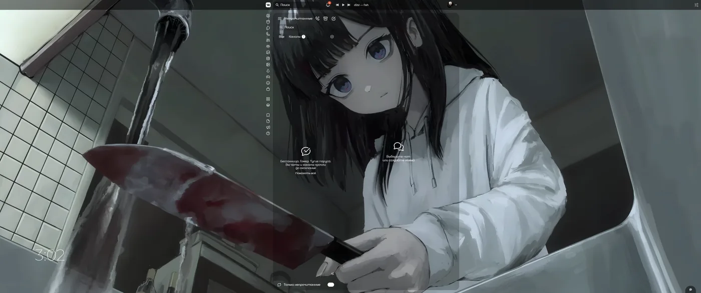
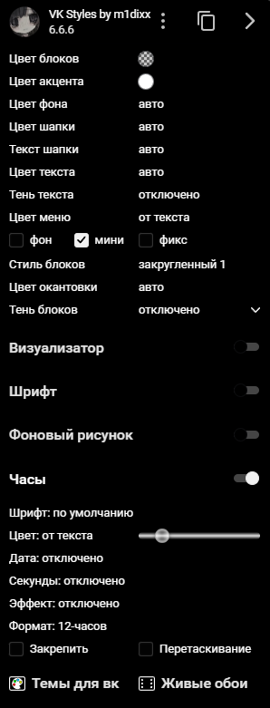
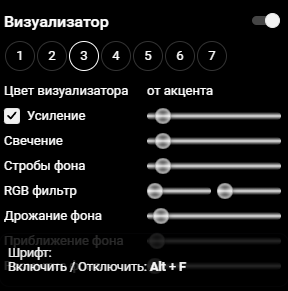
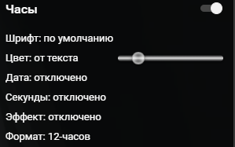
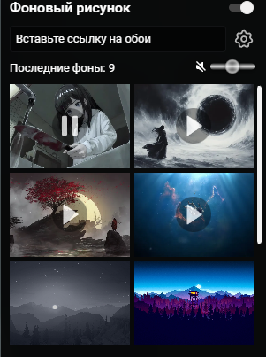

# VK Styles by m1dixx

**Make VKontakte look the way you want.**
Themes, fonts, colors, live wallpapers, a clock and an audio visualizer, in one small menu.

[Website](https://m1dixx.pages.dev/VK-Styles-by-m1dixx) &nbsp;/&nbsp; [Telegram](https://t.me/wmiwx) &nbsp;/&nbsp; [Releases](../../releases)

 

## Before and after

| Before | After |
| :---: | :---: |
|  |  |

## What it does

- **Colors.** Blocks, accent, background, header, text, menu and outline. Pick a color or leave it on auto.
- **Block styles.** Square or rounded corners, outline color and shadow.
- **Fonts.** Swap the font of the whole site. `Alt + F` turns it on and off.
- **Wallpapers.** Paste a link to an image or a video, the last ones you used are saved.
- **Clock.** Own font and color, date, seconds, effect, 12 or 24 hour format. Pin it or drag it anywhere.
- **Visualizer.** Seven presets with amplification, glow, strobes, RGB filter and shake. It reacts to the music playing on the page.
- **Dropper.** Grab any color from the page with `Alt + Z`.
- **Media keys.** Play, pause, next and previous work even when the tab is in the background.
- **Share.** Copy a link to your settings and send your theme to a friend.

&nbsp;
&nbsp;
&nbsp;

## Install

1. Download the latest archive from [Releases](../../releases) and unzip it.
2. Open `chrome://extensions` and turn on **Developer mode**.
3. Press **Load unpacked** and choose the unzipped folder.
4. Open VKontakte and click the extension icon.

Works in Chrome and other Chromium browsers (Edge, Brave, Opera, Yandex Browser).

## Permissions

| Permission | Why |
| --- | --- |
| `storage` | Keeps your settings |
| `scripting`, `tabs` | Applies the theme to VKontakte tabs |
| `contextMenus` | Right click menu of the extension |
| `declarativeNetRequest` | Lets wallpapers and fonts load on the page |
| `vk.com`, `vk.ru` | The only sites the extension works on |
| optional: all sites, `activeTab` | Only if you use the dropper or load media from other sites |

The source has no analytics and no tracking. The extension only talks to VKontakte and to the links you add yourself, like wallpapers.

## Support

Questions, ideas and bug reports: [Telegram](https://t.me/wmiwx) or [Issues](../../issues).

<!-- Add your license here -->

 

<b>Русская версия</b>

 

## Что это

Расширение, которое меняет внешний вид ВКонтакте: темы, шрифты, цвета, живые обои, часы и визуализатор звука. Всё настраивается в одном небольшом меню.

## Возможности

- **Цвета.** Блоки, акцент, фон, шапка, текст, меню и окантовка. Свой цвет или авто.
- **Стиль блоков.** Квадратные или закруглённые, цвет окантовки и тень.
- **Шрифты.** Меняют шрифт всего сайта. `Alt + F` включает и выключает.
- **Обои.** Вставь ссылку на картинку или видео, последние обои сохраняются.
- **Часы.** Свой шрифт и цвет, дата, секунды, эффект, формат 12 или 24 часа. Можно закрепить или перетащить.
- **Визуализатор.** Семь пресетов: усиление, свечение, строби, RGB фильтр и дрожание. Реагирует на музыку на странице.
- **Пипетка.** Берёт любой цвет со страницы по `Alt + Z`.
- **Медиаклавиши.** Пауза, следующий и предыдущий трек работают, даже когда вкладка в фоне.
- **Поделиться.** Скопируй ссылку на настройки и отправь свою тему другу.

## Установка

1. Скачай последний архив из [Releases](../../releases) и распакуй его.
2. Открой `chrome://extensions` и включи **режим разработчика**.
3. Нажми **Загрузить распакованное расширение** и выбери папку.
4. Открой ВКонтакте и нажми на иконку расширения.

Работает в Chrome и других браузерах на Chromium (Edge, Brave, Opera, Яндекс Браузер).

## Права

Расширение работает только на `vk.com` и `vk.ru`. Права `storage`, `scripting`, `tabs`, `contextMenus` и `declarativeNetRequest` нужны для настроек, применения темы, меню и загрузки обоев со шрифтами. Доступ ко всем сайтам необязательный и нужен только для пипетки и медиа с других сайтов. Аналитики и слежки в исходниках нет.

## Поддержка

Вопросы, идеи и баги: [Telegram](https://t.me/wmiwx) или [Issues](../../issues).

